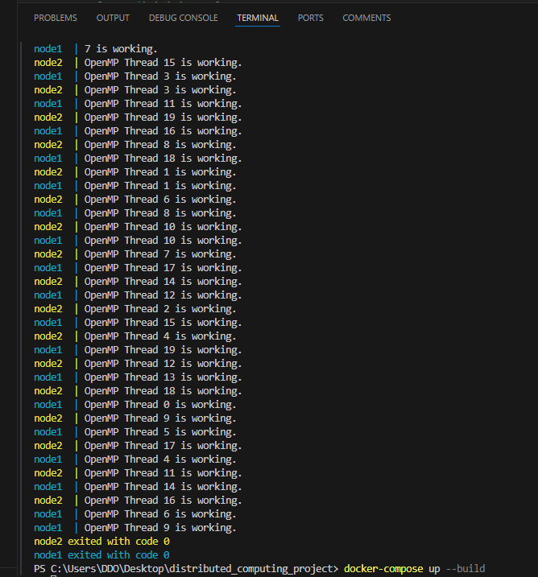

# Dağıtık Hesaplama Ödevi: Docker, MPI ve OpenMP Kullanarak Paralel Veri İşleme

## Ödev Açıklaması
Bu projede, Docker kullanarak birden fazla düğüm içeren bir dağıtık sistem kurulmuş ve bir veri seti OpenMP ve MPI kullanılarak paralel bir şekilde işlenmiştir. Proje, Docker Compose ile birden fazla konteyner çalıştırarak dağıtık hesaplama ortamı oluşturur ve veri kümesinin farklı düğümlerde parçalı hesaplanmasını sağlar. 

### Teknolojiler
- **Docker & Docker Compose**: Birden fazla konteyneri yönetmek ve dağıtık ortam oluşturmak için kullanıldı.
- **MPI (Message Passing Interface)**: Düğümler arasında büyük veri paylaşımı ve iletişimi sağlamak için kullanıldı.
- **OpenMP (Open Multi-Processing)**: Her düğümde çok çekirdekli paralel işlem yaparak veriyi daha hızlı işlemek için kullanıldı.


## Kullanım Talimatları

### 1. Gereksinimler
Bu proje için aşağıdaki yazılımların yüklü olması gerekmektedir:
- Docker
- Docker Compose

### 2. Projeyi Çalıştırma

#### Docker ve Docker Compose ile Çalıştırma

Projeyi çalıştırmak için Docker ve Docker Compose kullanacağız. Aşağıdaki adımları izleyebilirsiniz:

1. **Proje Dosyalarını İndirme**:
   
   GitHub repository'sini indirin:
   ```bash
   git clone https://github.com/username/distributed-computing-assignment.git
   cd distributed-computing-assignment

**3.Performans Karşılaştırması**:


Projenin performans karşılaştırması, MPI ve OpenMP'nin paralel veri işleme üzerindeki etkilerini gözler önüne seriyor. MPI ile düğümler arasında veri paylaşımı yapılırken, OpenMP her düğümdeki çok çekirdekli işlem gücünü kullanarak verilerin daha hızlı işlenmesini sağlar. Yapılan testlerde, OpenMP'nin tek bir düğümde çalıştırıldığı durumlarda verimliliği artırdığı gözlemlenmiştir. Ancak, MPI'nin düğümler arası veri paylaşımı sağlama kapasitesi, daha büyük veri setleriyle çalışırken OpenMP'den daha iyi performans göstermektedir.

